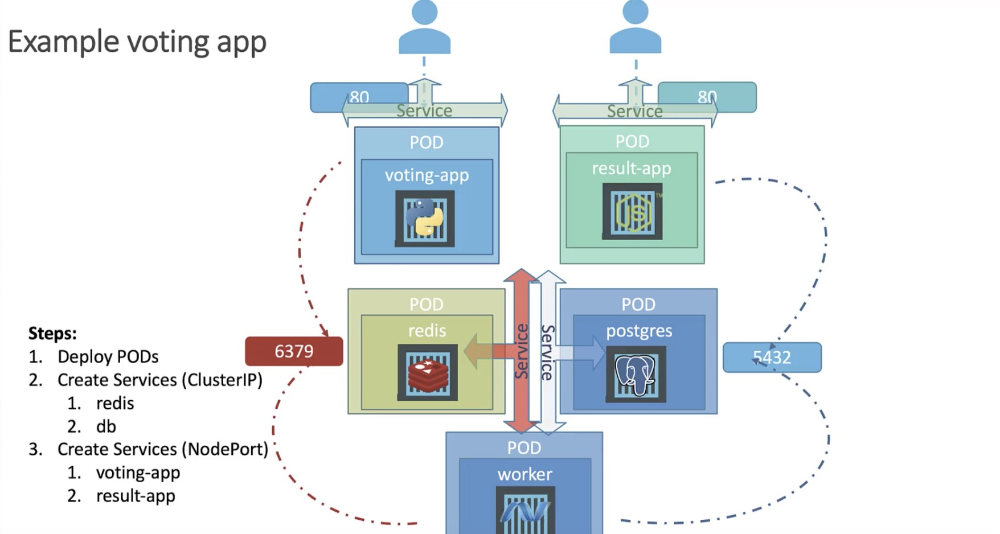
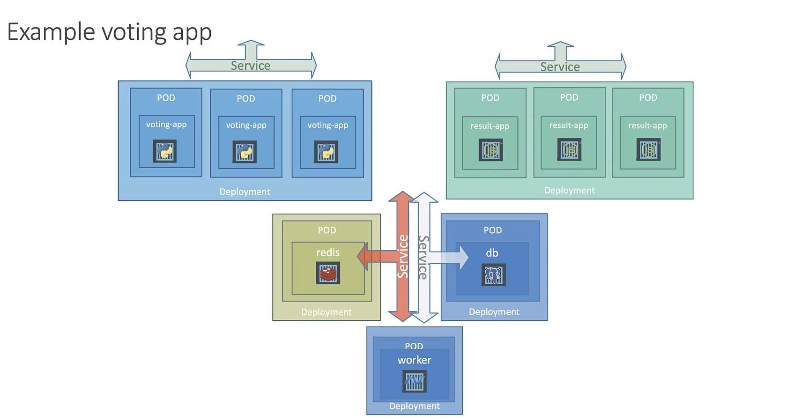

- Microservices
    - Example voting app
    - Goals
        - Deploy Containers
        - Enable Connectivity
        - External Acess
        
    - Steps
        - Deploy PODs
        - Create Services (ClusterIP)
            - redis (name the service as redis)
            - db
        - Create Services (NodePort)
            - voting-app
            - result-app
    
    - Deployment-Version
    