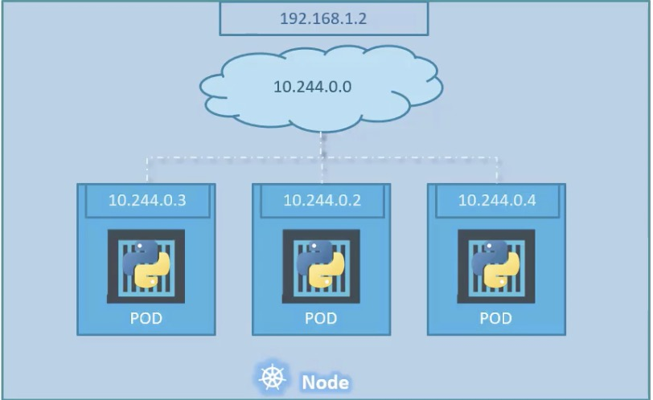
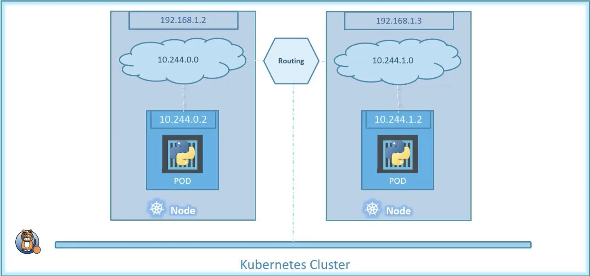

- Networking
    - the IP address is assigned to a pod, each part in the kubernetes gets its own internal IP address
    - when kubernetes initially configured, create an internal private network with the address
    eg: 10.244.0.2, all the pods are attached to it, when deploy multiple pods, they will get a separate IP
    assigned from this network, the pods can communicate to each other through these IP,
    
    - cluster Networking
        - kubernetes expects us to setup networking to meeting certain fundamental requirements
        - setup criterion
            - All containers/PODs can communicate to one another without NAT
            - All nodes can communicate with all containers and vice-versa without NAT
        - tool
            - Cisco SCI
            - cilium
            - big cloud fabric
            - flannel
            - NSX T
            - Kaliko
        