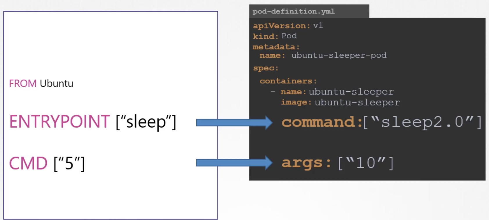
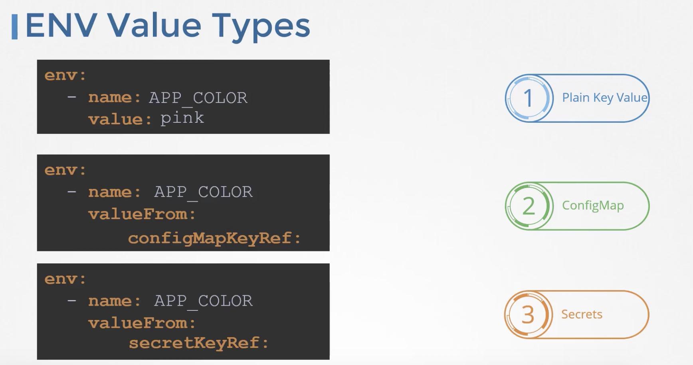
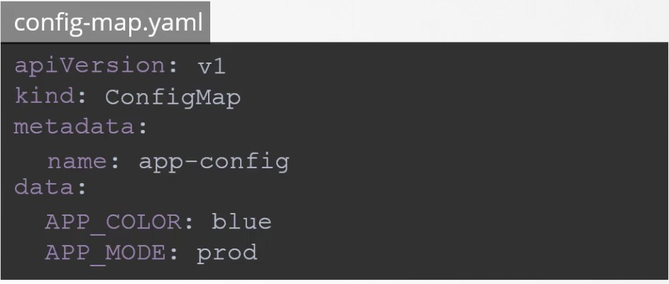
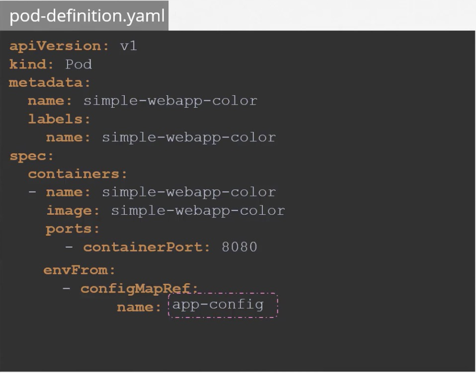
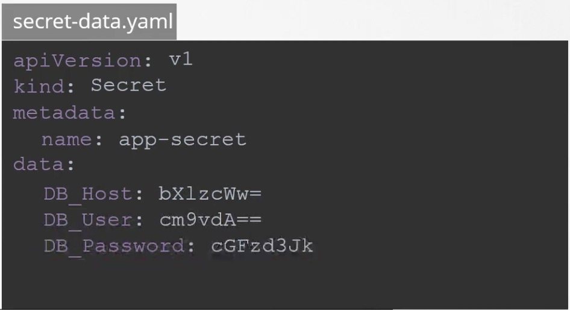
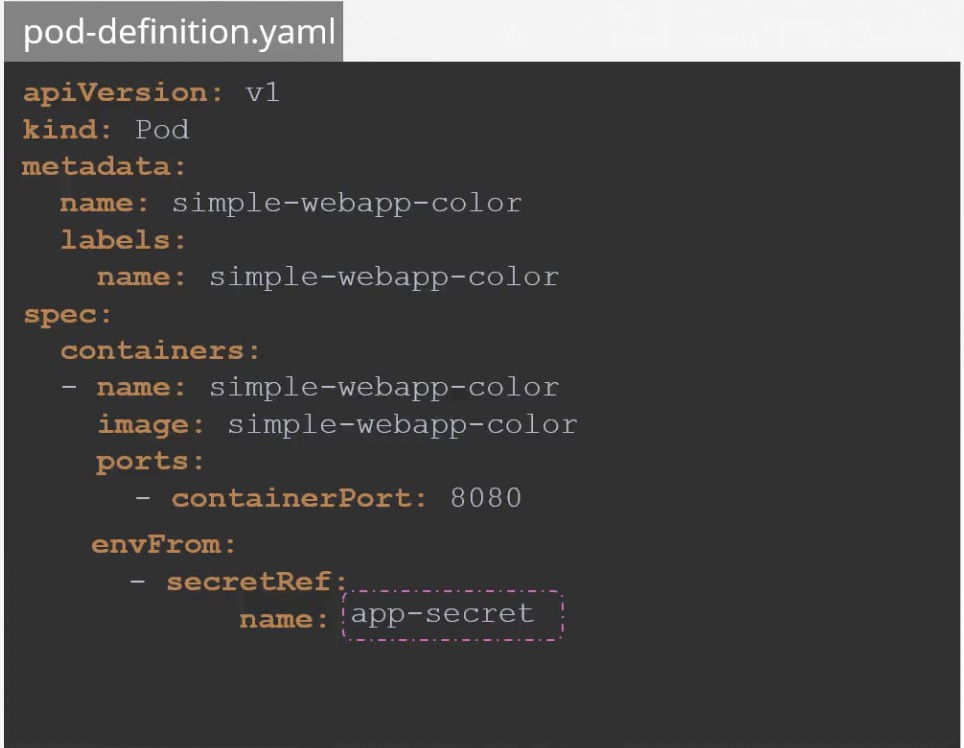

- Commands and Arguments in kubernetes
    
- ENV Value types
    
    - configMaps
        - pass configuration data in the form of key value pairs in kubernetes
        - when pod is created inject the config map into pod
        - phase
            - create configMap
                - imperative
                    - kubectl  create configmap  <config-name> --from-literal=<key>=<value>
                    - kubectl  create configmap  <config-name> --from-file=<path-to-file> (xxx.properties)
                - declarative
                    
            - inject into pod
        - view configmaps
            - kubectl get configmaps
        - configMap in pods
         
    - Secret
        - store sensitive information like password or keys
        - phase
            - create secret
                - imperative
                    - kubectl  create secret generic  <secret-name> --from-literal=<key>=<value>
                    - kubectl  create secret generic  <secret-name> --from-file=<path-to-file> (xxx.properties)
                - declarative
                
                    - linux encode
                        - echo -n 'mysql' | base64
                    - linux decode
                        - echo -n 'asdasd==' | base64 --decode
            - inject to pod
                
            - view secrets
                - kubectl get secrets

- Multi-Container PODs
    