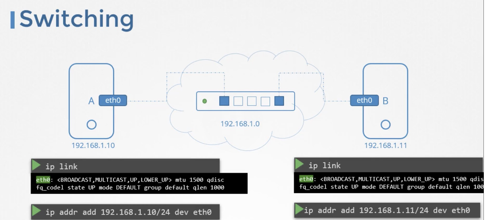
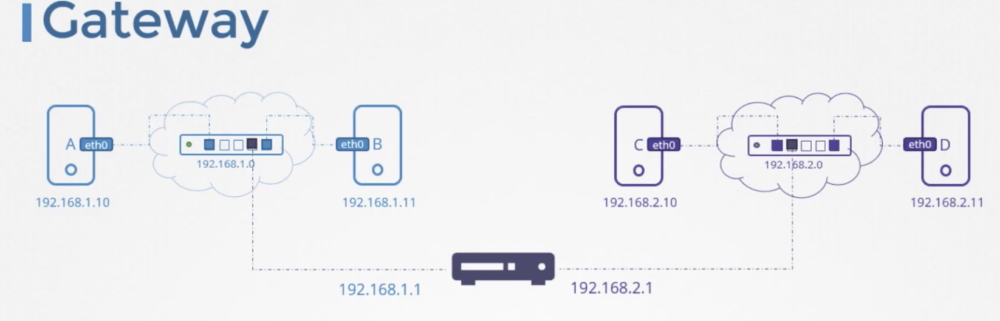
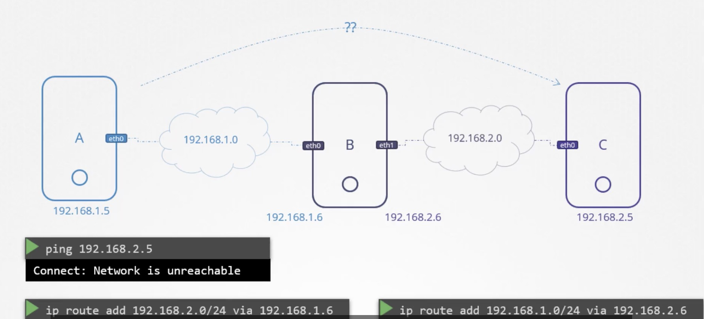
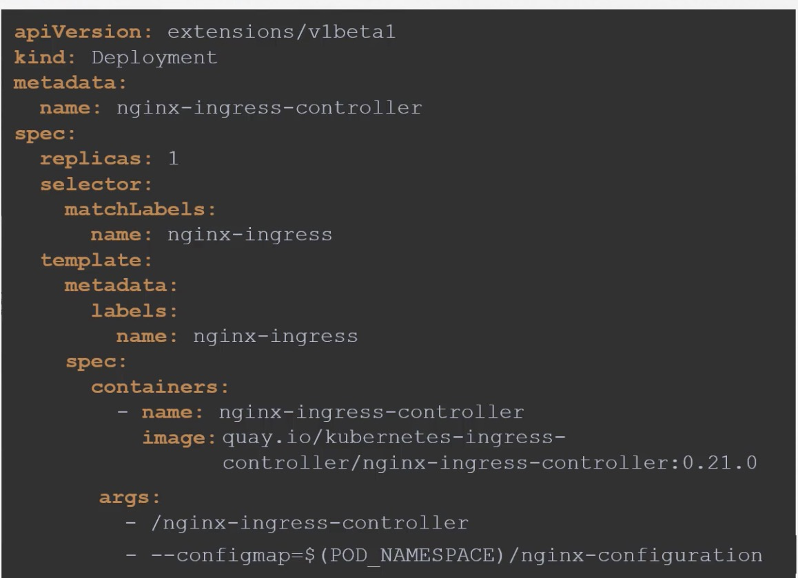
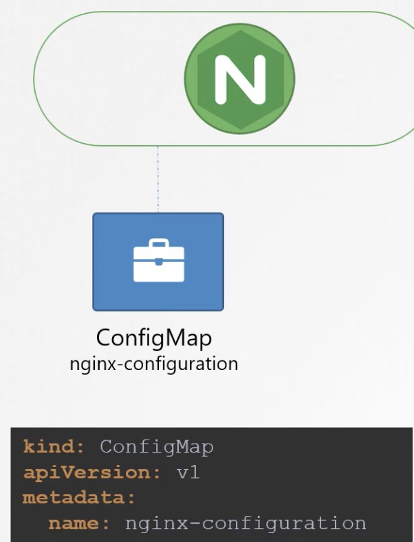

- Networking
    - Pre-Requisites
        - switching
            - two computers, we connect them to a switch, and a switch creates a network containing the two systems
            - we need an interface on each host, physical or virtual depending on the host to see the interfaces for 
        
        - routing
            - a Router helps connect two networks together
            - it gets two IPs assigned, one on each network
            - command
                - ip route add 192.168.2.0/24 via 192.168.1.1
                    - configure a gateway on system B to reach the system on network 192.168.2.0
                - internet
                - ip route add default via 192.168.2.1
                    - this way any request to any network outside of your existing network goes to this particular router
                - ip route add 0.0.0.0 via 192.168.2.1
                    - it doesn't need a gateway because it is in its own network 
                
        - gateway
            - is a door to the outside world to other network
        
        - router-table-eg:
        
            - +forward packets between interfaces is governed by a setting in this system at file /proc/sys/net/ipv4/ip
                - cat /proc/sys/net/ipv4/ip_forward  (0-> no forward 1-> forward)
                - /etc/sysctl.conf
                    - net.ipv4.ip_forward=1
- prerequsite DNS
    - name resolution 
    - entries into single server who manage it centrally -> DNS server
        - instead host file
        - cat /etc/ resolv.conf
            - nameserver 192.168.1.100
        - first look in the local /etc/hosts then looks at the name server
            - order is defined by an entry in the file /etc/nsswitch.conf
        - cat >> /etc/resolv.conf nameserver 8.8.8.8 well known public name server
    - apps.google.com
        - org-DNS -> Root-DNS -> .com-DNS -> Google.DNS
        
- prerequsite Network Namespace
- Container Networking Interface
- Pod Networking
    - Networking Model
        - Every POD should have an IP Address
        - every POD should be able to communicate with every other POD in the same node
        - every POD should be able to communicate with every other POD on the nodes without NAT

- Ingress
    - Ingress controller
        - nginx-ingress-controller
        
        
        - components
            - service to expose
            - a configMap to feed NGINX configuration data
            - a service account with right permission to access all of these objects
    - Ingress resources
        - a set of rules and configurations applied on the ingress controller
            - route traffic to different applications based on the URl