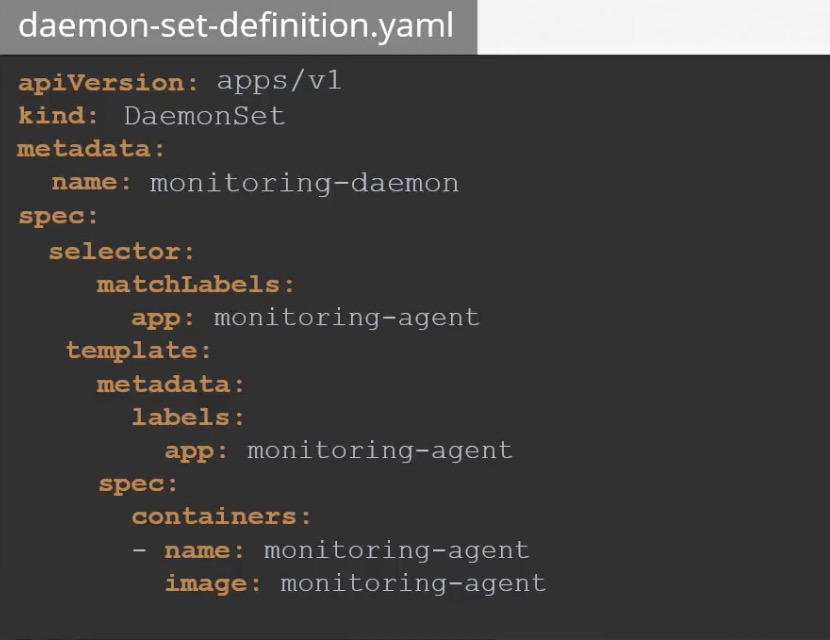

- Scheduling
    - yaml property set: nodeName
        - the scheduler goes through all the pods and looks for those that do not have this property set
        those are the candidates for the scheduling, then it identified the right node of the POD by some algorithm, 
        once identified it schedules the POD on the node by setting the node Name property 
    - no scheduler 
        - pod status: pending
        - you can manually assign pods to node yourself
            - set the nodeName field to the name of the node (in creation time)
            - create a binding object and send a post request to the pod binding API (exist pod)
            
            
- Labels and Selectors
    - group and select objects use labels and selectors
    
- Taints And tolerations
    - set restriction on what pods can be scheduled on a node
    - taints are set on nodes and tolerations are set on pods
    - Tains-Node
        - kubectl taint nodes node-name key=value:taint-effect
        - taint-effect
            - NoSchedule
            - PreferNoSchedule
                - system will try to avoid placing a pod on the node, but that is not guaranteed
            - NoExecute
                - new pods will not be scheduled on the node
                - the existing pods on the node if any
                will be evicted if they do not tolerate the taint
    - Tolerations-PODs
        
    - the scheduler does not schedule any pods on the master node, when the kubernetes cluster is first set up,
    a taint is set on the master node automatically, that prevents any pods from being scheduled on this node

- Node selector
    - limit pod
    
    - pair of size and large are in fact labels assigned to the nodes, the schedule uses these labels to match, 
    and identify the right node to place the pods on label selectors are 
    - label nodes 
        - kubectl label nodes <node-name> <label-key>=<label-value>
            - eg: kubectl label node1 size=large
    - when the pod is created, it is placed on node1 as desired 
    - limitations
        - if requirements are complex, can not achieve it  
        
- Node Affinity
    - limit pod
    
    - Node Affinity types
        - there two states in the lifecycle of a pod when considering node affinity during scheduling 
             - during scheduling 
                - where the pod is not exist and is created for the first time
                - the affinity rule specified are considered to place pod on the right node
             - during execution
                - ignored
        - Available
            - requiredDuringSchedulingIgnoredDuringExecution
            - preferredDuringSchedulingIgnoredDuringExecution
        - Planned
            - requiredDuringSchedulingRequiredDuringExecution
            - preferredDuringSchedulingRequiredDuringExecution
            
- Node Affinity vs Taints and Toleration

- Resource Limits
    - if there is no sufficient resource available in any of the nodes, kubernetes hold back scheduling the pod, 
    the pod is pending, events: Insufficient cpu
    - by default, kubernetes assume that pod witin the container requires .5 cpu and 256m
     
    - limit
        - 1vCPU
        - 512Mi
    - exceed limit 
        - cpu: throttle
        - memory: terminate
        
- Daemon Sets
    - runs one copy of your pod on each node in your cluster,
    whenever a new node is added to the cluster a replica of pod is automatically added to that node
    - useCase
        - would like to deploy a monitoring agent or log collector on each of your nodes in the cluster
        daemon set is perfect for that as it can deploy your monitoring agent in the form of a pod in all nodes, then you don't have to worry about adding/removing 
        - kube-proxy
        - weave net
     
    - Command
        - kubectl get daemonsets
        - kubectl create -f 
    - how does it work
        - set the nodeName property in its specification (before v1.12)
        - use node affinity rules to schedule pods on nodes
        
- Static PODs
     
    - the kubelet can manage a node independently 
    - without kube-api server
        - configure the kubelet to read the pod definition files from a directory on the server designated to store information
        - create pods and ensure the pod stays alive 
        /etc/kubernetes/manifests
        - cannot create replicasets or deployments, only pods
        - run docker ps
    - useCase
        - use static pods to deploy the control plane components itself as pods on a node, 
        then create pod definition files use docker image, place the definition files in the designated manifests folder, and kubelet takes care of deploying 
        the control plane components as pods on the cluster
   
- static PODs vs DaemonSets
    -  |  Static PODs   | DaemonSets  |
        |  ----  | ----  |
        | created by kubelet | created by apiserver (DaemonSet controller) |
        | Service | v1 |
        

- Multiple Schedulers
    - custom scheduler 
     
     
    - view events
        