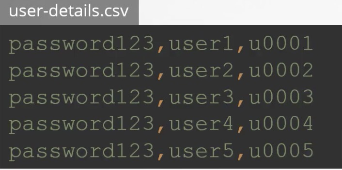
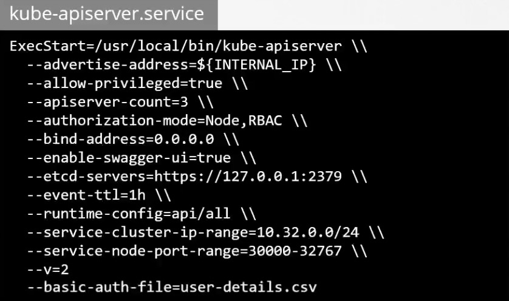
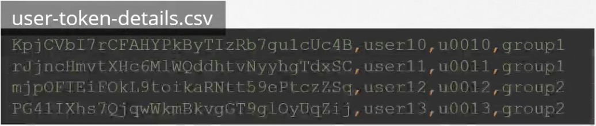
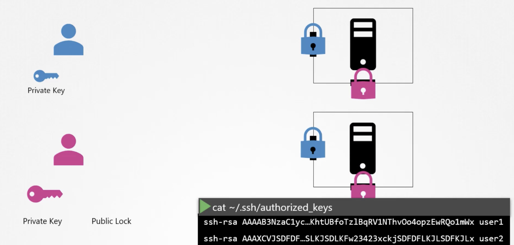
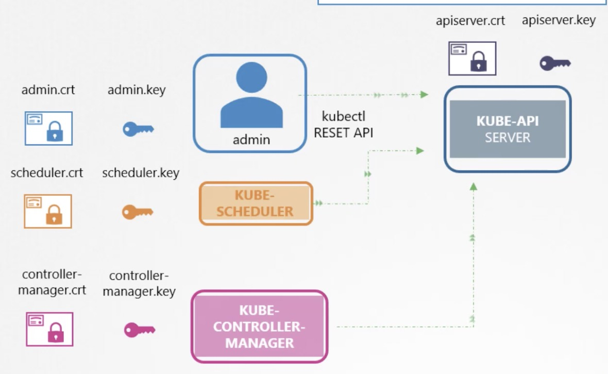
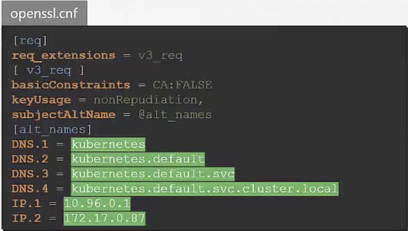

- kubernetes security primitives
    - authentication
        - who can access
            - Files
                - username and password
                - username and token
            - certificates
                - TLS certificates
                    - all communicates with the cluster, between the various components.
                    - 
            - external authentication providers - LDAP
            - service accounts
        - what can they do
            - RBAC authentication 
            - ABAC authentication
            - Node authentication
            - Webhook Mode
    - Accounts
        - user
            - admins
            - developers
            - service accounts
        - you can create and manage service accounts using the kubernetes API
            - kubectl create serviceaccount sa1
            - kubectl list serviceaccount
        - all user access is managed by the API server (kube-apiserver)
            - both kubectl and curl kube-server-ip
        - auth mechanisms
            - static file (not a recommended )
                - static password file
                    - user-details.csv
                         
                    - kube-apiserver --basic-auth-file=user=detail.csv
                         
                    - authenticate user
                        - curl -v -k https://master-node-ip:6443/api/v1/pods -u "user1:password123"
                - static token file
                    - user-token-detail.csv
                        
                    - --token-auth-file=user-detail.csv 
                    - authenticate user
                        - curl -v -k https://master-node-ip:6443/api/v1/pods --header "Authorization: bearer asdasdasdnksdfjkj"
            - certificates
            - third party authentication protocols, LDAP
        
- TLS
    - a certificate is used to to guarantee trust between two parties during transaction
    - TLS certificate ensure that the communication between the user and the server is encrypted 
    - a copy of the key must sent to the server 
    - Asymmetric encryption -ssh
        - you have a server in your environment that you need to access
        - you don't want to use password as they're too risky
        - use key pairs
        - generate a public and private lock pair 
        - ssh-keygen -> id_rsa(private key), id_rsa.pub (public lock)
        - you then secure you server by locking down all access to it
        - except through a door that is locked using your public lock
            - adding en entry with your public key into the server's ssh/authorized_keys file
        - ssh -i id_ras user1@server1
        - what if other users need access to your servers 
            - they can generate their own public and private key pairs 
            - as the only person, who has access to those servers 
            - you can create an additional door for them, and lock it with their public locks
            - copy their public locks to all the servers, now other users can access the server using their private keys
                - adding en entry with your public key into the server's ssh/authorized_keys file
        
    - web server eg:
        - openssl genrsa -out my-bank.key 1024
        - openssl rsa my-bank.ley -pubout > mybank.pem
        - when the user first access the webserver using https
        - he get the public key from the server
        - the user in fact, the user's browser then encrypts the symmetric key using public key provided by the server 
        - then user sends this to the server 
        - the server use the private key to decrypt the message, and retrieve the symmetric key from it 
        - the hacker now looks for new ways to hack into your account, so he creates a website that looks exactly like your bank's website
        - what if you could look at the key you received from the server and see if it is a legitimate key from real bank's server
        - when the server sends the key, it does not send the key alone, it sends a certificate that has the key in it
        - how do you look at a certificate and verify it is legit
            - who signed and issued the certificate
            - if you generated a certificate, you will have to sign it by yourself(self-signed certificate)
            - all of the web browser are built-in with certificate validation mechanism, where in the browser checks the certificate received from the server
        - CERTIFICATE AUTHORITY (CA)
            - well-known org that can sign and validate your certificates for you 
            - how make a legitimate certificate 
            - how do you get your certificates signed by someone with authority
            - step
                - you generate a certificate signing request, using the key generated earlier and the domain name
                    - openssl req -new -key my-bank.key -out my-bank.csr -subj "/C=US/ST=CA/O=MyOrg, Inc./CN=mydomain.com"
                - validate information
                - sign and send Certificate
                    - you now have a certificate signed by CA that the  browser trust    
            - the CAs themselves have a set of public and private key pairs, the CAs use their private keys to sign the certificates, the public key of all the CAs are built-in to the browsers, the browser uses the public key of the CA to validate that the certificate was actually signed
  - TLS in kubernetes
    - administrator with the kubernetes cluster through the kubectl utility or via accessing the kubernetes API directly must establish secure TLS connection 
    - server certificate for servers
        - Kube-API server
            - kube-api expose HTTP a service that other components as well as external users use to manage the kubernetes cluster
            - generate a certificate(API server.crt) and key pair (APIserver.key)
            - the certificate names could be different in different kubernetes setups depending on who and how the cluster was setup
        - ETCD server
            - etcdserver.crt etcdserver.key
        - Kubelet server
            - kubelet.crt kubelet.key
    - client certificate for clients
        - admin 
            - admin.crt admin.key 
        - kube scheduler
            - scheduler.crt scheduler.key
        - kube controller manager 
            - controller-manager.crt controller-manager.key
        - kube proxy 
            - kube-proxy.crt kube-proxy.key
        
        
  - generate certificate
    - generate keys 
        - openssl genrsa -out ca.key 2048 -> ca.key
    - certificate signing request
        - openssl req -new -key ca.key -su "/CN=KUBERNETES-CA" -out ca.csr -> ca.csr
        - kubeapi
            - openssl req -new -key apiserver.key -subj "/CN=kube-apiserver" -out apiserver.csr -config openssl.cnf
            
    - sign certificates
        - server
            - openssl x509 -req -in ca.csr -signkey ca.key -out ca.crt -> ca.crt
            - ca now has its private key and root certificate file
        - client
            - openssl x509 -req -in admin.csr -CA ca.crt -CAkey ca.key -out admin.crt
            - you specify the CA certificate and the CA key, you're signing your certificate with the CA key pair
    - curl https://kube-apiserver:6443/api/v1/pods --key admin.key --cert admin.crt --cacert ca.crt
    - kubeconfig
        
        