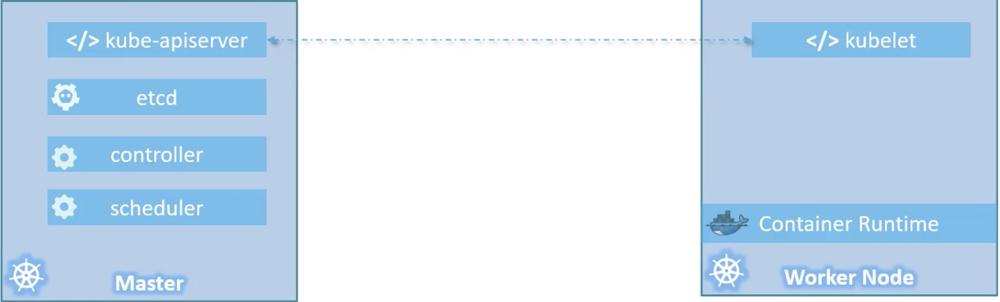

- Containers
    - docker container
- orchestration

- Architecture
    - overview 
    - cluster
        - master 
            - kube-apiserver
            - etcd
            - controller
            - scheduler
        - Nodes
            - kubelet
            - container Runtime
    - components
        - API server
            - acts as the front-end for kubernetes, users, management devices, command line interfaces, all talk to the 
            API server to interact with kubernetes cluster
        - etcd
            - distributed key value store, to store all data used to manage the cluster
            - responsible for implementing locks within the cluster to ensure that are no conflicts between the master
        - Schedule
            - responsible for distributing work across multiple nodes, it look for newly created containers and assigns them to nodes
        - kubelet
            - is agent that runs on each node in the cluster, responsible for making sure that containers are running on the nodes as expected
        - Container Runtime
            - underlying software that is used to run containers (Docker)
        - Controller
            - brain behind orchestration, responsible for noticing and responding when nodes, containers or endpoints goes down
            - make decisions to bring up new containers

- kubectl
    - kube command line tool
    - used to deploy and manage application on a kubernetes cluster, get cluster information, get the status of other nodes in the cluster and manage many other things
    - Command
        - run
            - kubectl run hello-minikube
            - deploy an application on the cluster
        - cluster-info
            - kubectl cluster-info
            - view information about the cluster 
        - get nodes
            - kubectl get nodes
            - list all the nodes part of the cluster