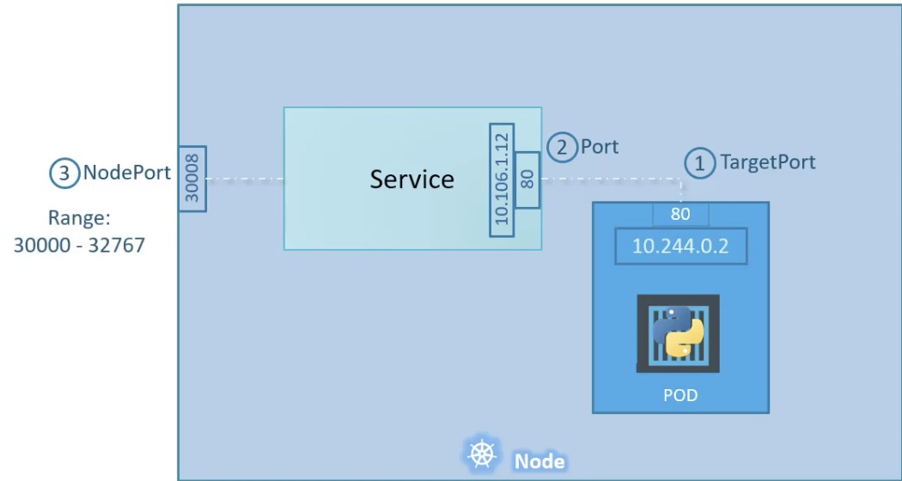

- service
    - virtual server , has own IP address
    - enable communication between various components within and outside of the application
    - connect applications together with each applications or users
    - enable loose coupling between micro services
    - listen to a port on the node forward request on that port to a port on the pod
    - types
        - nodeport (30000~32767)
            - make an internal pod accessible
            - mapping a port on the node to a port on the pod
            - three port involved
                - targetPort
                    - the port on the pod (target port)
                - port
                    - the port on the service
                    - if don't provide a target port it is assumed to be the same as port
                - nodePort
                    - the port on the node
                    - if don't provide nodePort, a freeport in the valid range between 30000 and 32767 is automatically alocated
            - use labels and selectors to link port and target port
        - clusterIP
            - create a virtual IP inside the cluster to communication between different services
        - load balance
            - it provisions a load balance for application in supported cloud providers
    
    - Command
        - kubectl get services
    - case
        - multiple same pods in one node
            - the service automatically selects all the some same pods as endpoint to forward external requests coming from the user,
    it is use random algorithm, thus the service acts as a built in load balancer to distribute load across different pods
        - pods are distributed across multiple nodes
            - kubernetes create a service that spans across all the nodes in the cluster and maps that target port to the same node port
- ClusterIP
    - kubernetes service can help us group the pods together and provide a single interface to access the pods in a group,
    the request forward to one of the pods under the service randomly
    - targetPort
        - the port group of pods exposed
    - port
        - the port where the service is exposed
- Service - Load Balance